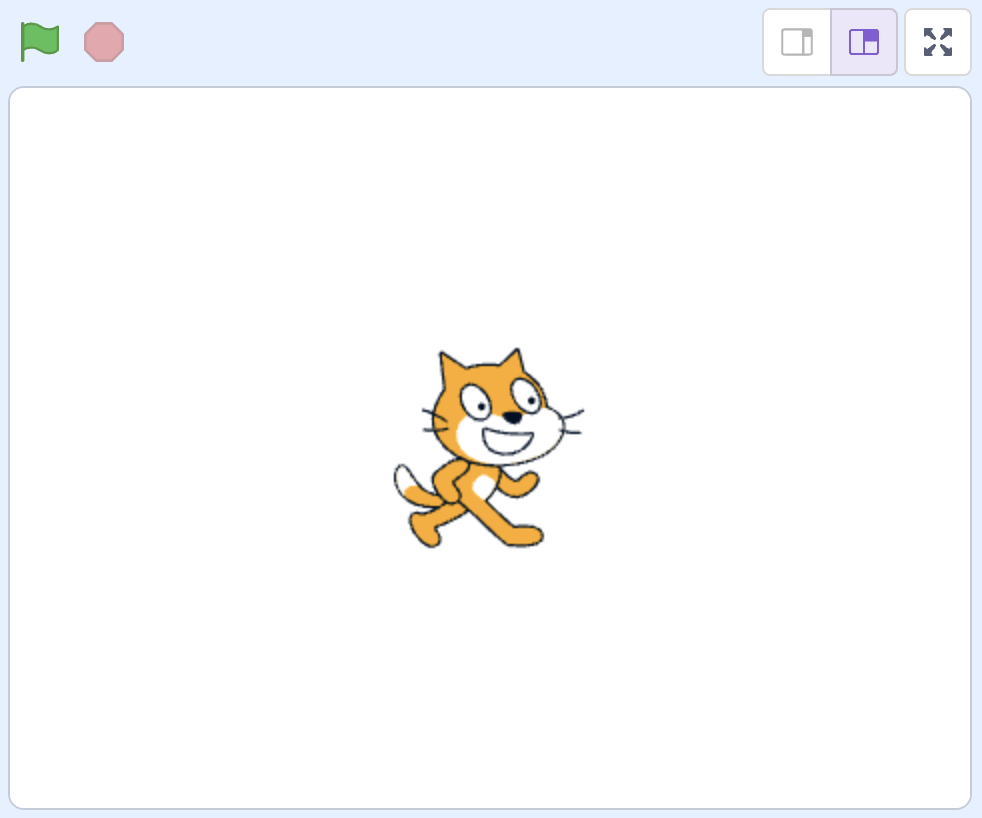
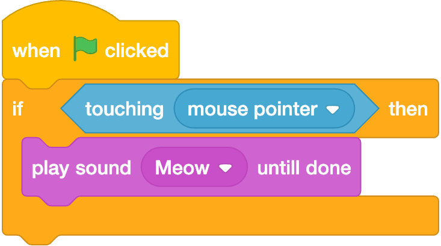

# Check for Understanding 0 

## Question 1 - When Green Flag Clicked

Suppose a classmate is implementing a Scratch project in which they'd like Scratch Cat to meow upon being "pet" by a user's mouse pointer. Their stage is set up per the below:

Within the sprite for Scratch Cat, your classmate has placed the following Scratch blocks:

It *seems* as if Scratch Cat should meow once the user's mouse pointer touches them. Instead, Scratch Cat is silent: the code seems to have a bug!

Explain to your classmate what their code is actually doing. Then, propose a fix.

|____|

## Question 2 - Ternary

It turns out some specialized computers don't use bits at all! "[Ternary computers](https://en.wikipedia.org/wiki/Ternary_computer)" instead represent information using "trits." Trits rely on base-3, whereby each trit can be 0, 1, or 2. For instance, **007 in decimal** would be **111 in binary** but **021 in ternary**. 🤔 

Without the (unnecessary) leading zeroes, **7 in decimal** would be **111 in binary** but **21 in ternary**.

Recall that a binary computer would represent the phrase "HI!" as a sequence of 3 bytes (i.e., 3 segments of 8 bits). Those 3 bytes would store, respectively, the decimal numbers 72, 73, 33, thanks to [ASCII](https://www.rapidtables.com/code/text/ascii-table.html). Or, if you prefer binary, `01001000`, `01001001`, `00100001`. 

How might a ternary computer represent the same phrase, "HI!", using **3** sequences of **4** trits? Again, a single trit is either 0, 1, or 2. Separate your sequences of 4 trits with a space.

|____|

Explain why what you've written above corresponds to the phrase "HI!".

|____|

## Question 3 - Abstractions

Recall from lecture that Scratch's custom blocks allow us to create "abstractions"—ways of naming and packaging otherwise complex procedures. Abstractions show up in everyday life, too. For example, in the evening you might change clothes, brush your teeth, get in bed, and fall asleep, but we often refer to that process just as "getting ready for bed."

Describe one other example of an abstraction from your daily life. Put another way, what's a process (or an object!) that's largely abstracted away for you?

|____|

## Question 4 - Emoji

Read this blog post on representation of families with emoji: <https://blog.emojipedia.org/on-families-and-equality/>

In your own words, what are the challenges, technical or otherwise, that come with supporting family emoji in which any family member can be represented by any skin tone?

|____|
