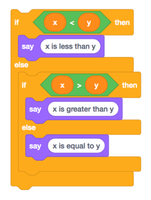

# Check for Understanding 1 

## Question 1 - Overflow


Recall that the _Year 2000 (Y2K) problem_ was the result of older software using just two digits to represent years, per <https://en.wikipedia.org/wiki/Year_2000_problem>. For instance `99` was assumed to represent `1999`. A year later, though, `00` might be misinterpreted as `1900` instead of `2000`. Imagine how overdue your library books might be if a computer thinks you checked them out a century ago!

Instead of two digits, newer software has tended to use 32 bits to represent the number of seconds since the "epoch," defined as January 1, 1970. Unfortunately, there's now a _Year 2038 problem_ on the horizon, per <https://en.wikipedia.org/wiki/Year_2038_problem>.

Explain this _Year 2038 problem_ in layperson's terms and how its proposed solution will postpone but not fundamentally solve the problem.

|____|

## Question 2 - Imprecision

Take another look, as needed, at the implications of (not understanding) floating-point imprecision by way of this video:



### Question 2.1 - Ariane 5

Explain, in a few sentences, how overflow led to the explosion of an Ariane 5 rocket.

|____|

You might find that the articles at <https://cdn.cs50.net/2023/fall/psets/1/little-bug-big-bang.pdf> and <http://www-users.math.umn.edu/~arnold/disasters/ariane5rep.html> offer a bit more detail.

### Question 2.2 - Scud Missiles

Explain, in a few sentences, how floating-point imprecision also led to Patriot missiles' failure to intercept Scud missiles.

|____|

You might find that <https://cdn.cs50.net/2023/fall/psets/1/after-war-army-blaming-patriot-s-computer-for-failure-stop-dhahran-scud.pdf> and <http://archive.gao.gov/t2pbat6/145960.pdf> offer a bit more detail.

## Question 3 - C

Consider the two blocks of C code below:

**Version 1**
```c
if (x < y)
{
    printf("x is less than y\n");
}
else if (x > y)
{
    printf("x is greater than y\n");
}
else if (x == y)
{
    printf("x is equal to y\n");
}
```

**Version 2**
```c
if (x < y)
{
    printf("x is less than y\n");
}
else if (x > y)
{
    printf("x is greater than y\n");
}
else
{
    printf("x is equal to y\n");
}
```

Those blocks are essentially equivalent to these Scratch blocks, respectively:

**Version 1**


**Version 2**



---

Why, in **Version 1**, do we use two equals signs (`==`) in C instead just one (`=`), as in Scratch?

|____|

Why is **Version 2**, whether implemented in Scratch or in C, arguably better designed than **Version 1**?

|____|