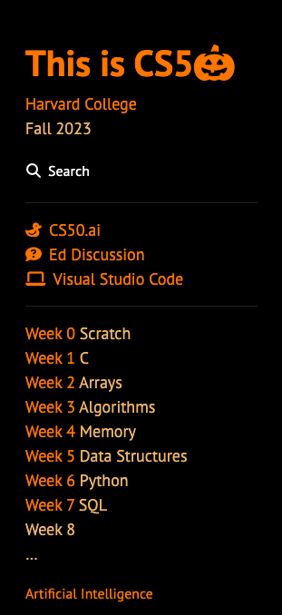

# Check for Understanding 8

## Question 1 - DNS

In your own words, what is DNS and why is it useful?

|____|

## Question 2 - Separation

Why might it be preferable to store CSS in a separate file, rather than including it inside our .html files?

|____|

## Question 3 - Holiday Theming

Not only was lecture Halloween-themed for Week 7, so is/was the course's website, per the screenshot below! Hypothesize (in English, no need for code) how the course might have implemented those colorful changes.

|____|

## Question 4 - JavaScripting

Consider a web app like Gmail (or, if you prefer, Outlook). What are two events that Google's JavaScript code (or Microsoft's JavaScript code) is likely "listening" for when you interact with Gmail (or Outlook), and why?

|____|